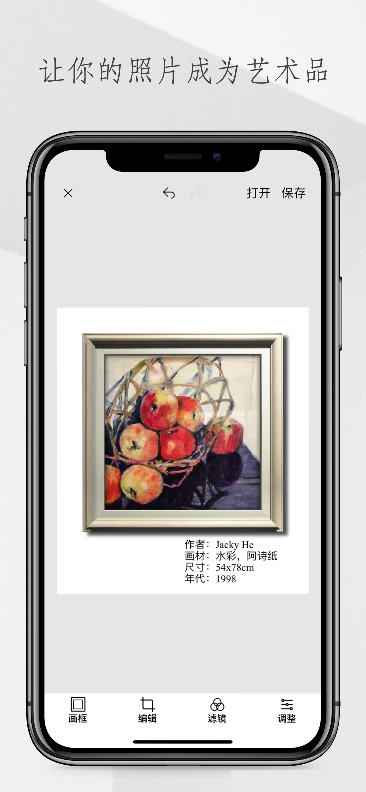
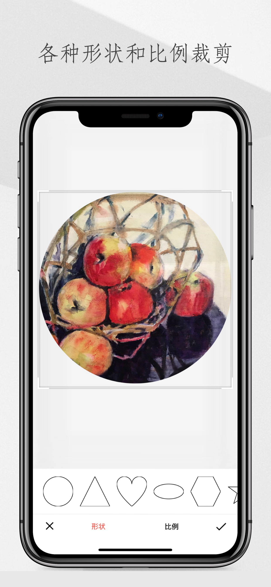
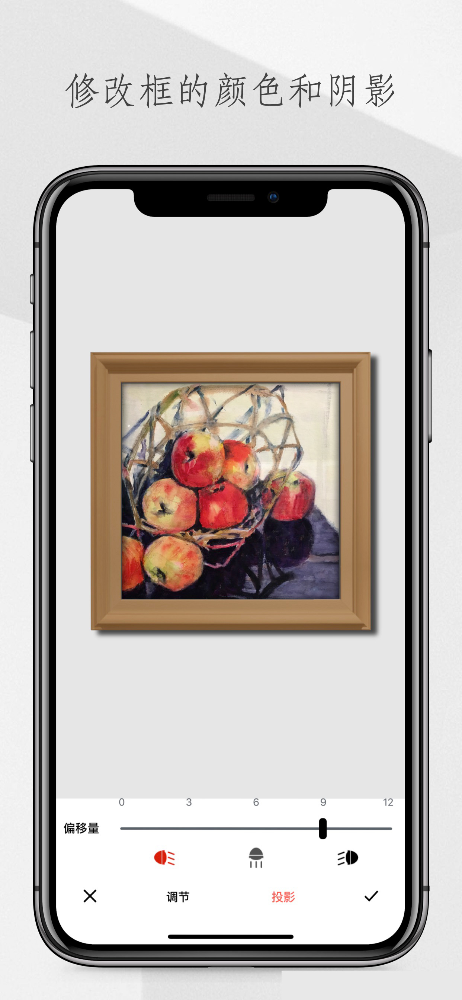
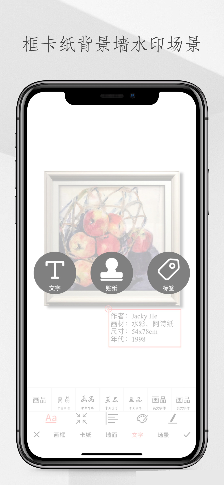
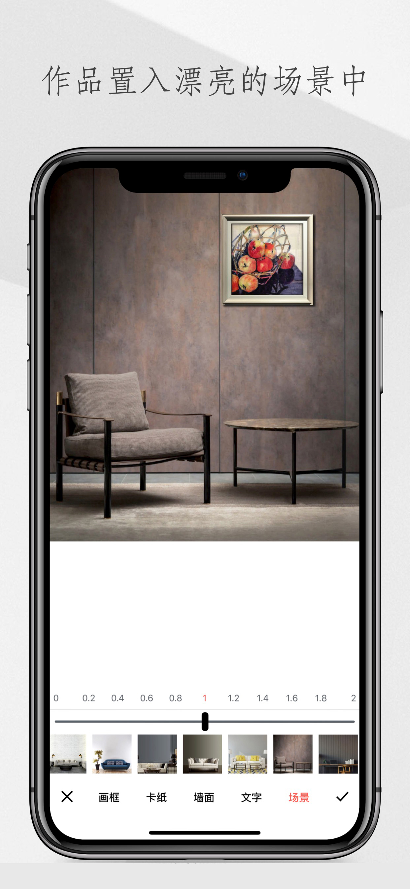
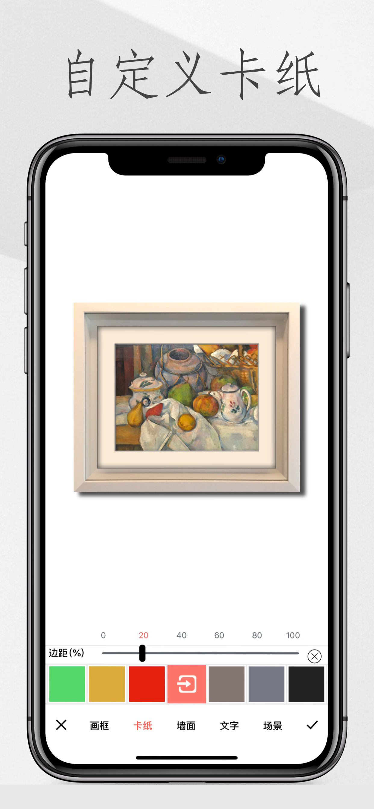
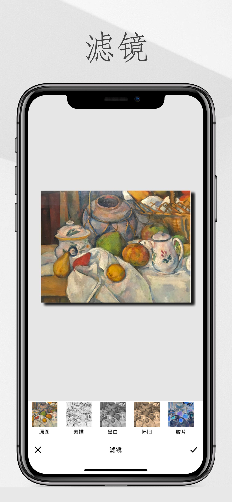
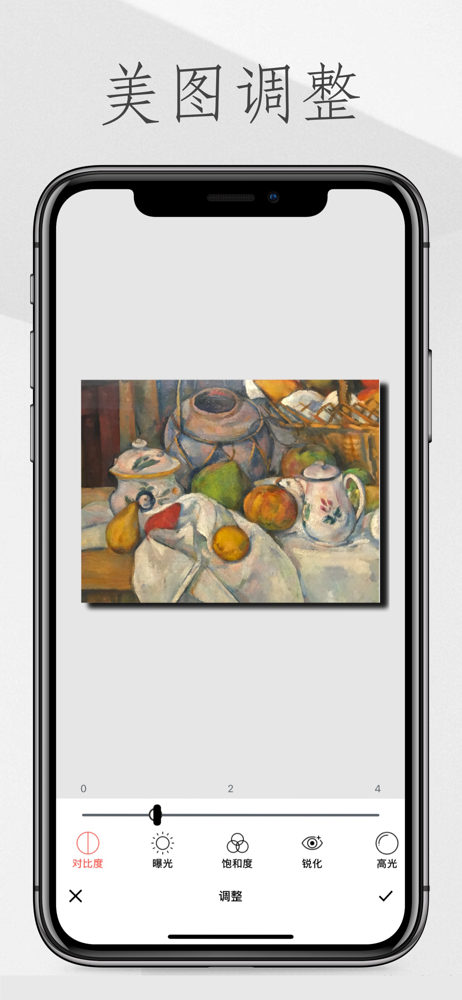
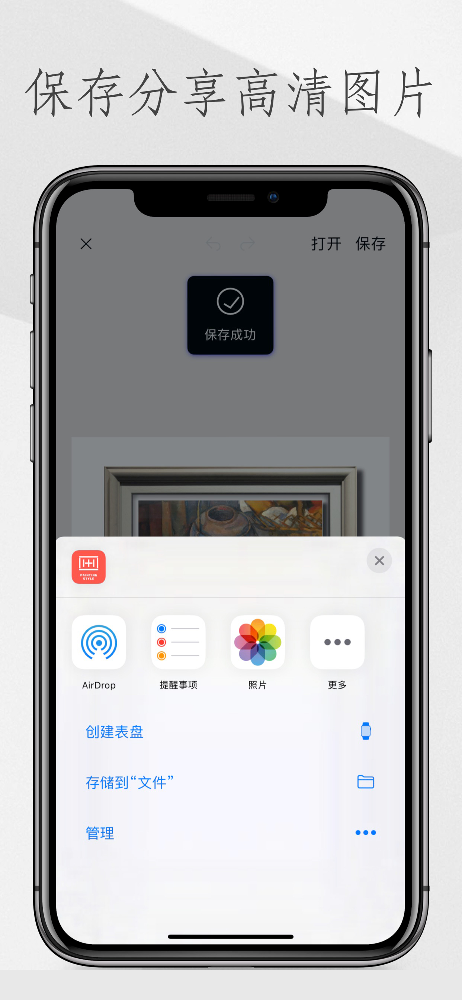

欢迎来到画品app的技术支持服务网站！

###邮箱：258255419@qq.com
###微信：hewei_0811
# **画品**
“画品”是一款为美术作品而专业打造的画框APP。所谓“三分画，七分裱”，好的画框本身就是一件艺术品，能为美术作品增色不少。严格来说，画与画框及展览场景与背景是一个整体的呈现，缺一不可。
“画品”APP精选高品位的画框，功能实用，随意组合，操作简便，给予美术作品全新的呈现方式，可以根据你的自由组合方式，重新定义作品的风格。
亮点功能：

 1. 变换外框的款式色彩；
 2. 变换卡纸边距色彩；    
 3. 变换背景/场景；   
 4. 设置投影光源方向；         
 5. 内置编辑功能；
 6. 内置滤镜功能；                  
 7. 高清保存/分享；
 
 
 
 
 
 
 
 
 
 
